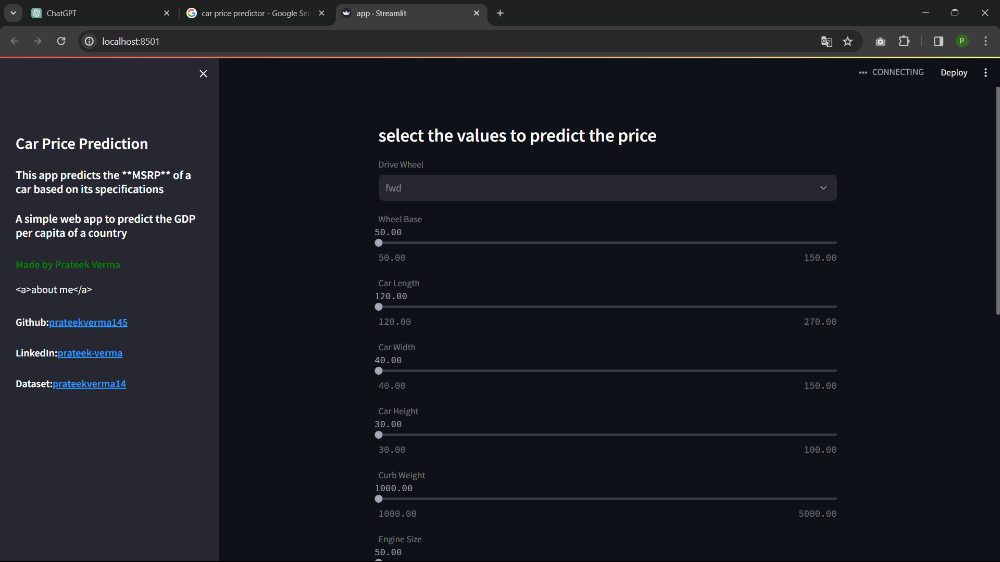

Welcome to the Car Price Predictor repository! This project is a machine learning model designed to predict the price of cars based on various features. Whether you're a data science enthusiast or looking to integrate car price predictions into your application, this repository has you covered.

## Features

Machine Learning Model: Our project utilizes a state-of-the-art machine learning algorithm to make accurate car price predictions.
User-Friendly Interface: We have included a simple and interactive user interface to easily input car features and obtain predictions.
Data Exploration: Check out the Jupyter Notebooks in the notebooks directory to explore the data and understand how the model was developed.

## Screenshots

link: https://carpricepredictor-abrqvmvltpzjqzmcl7c8pc.streamlit.app/
 ## Project Structure
- app.py: The main Python script for running the web application.
-  model.pkl: Contains the machine learning model for car price prediction.
-  notebooks/: Jupyter Notebooks used for data exploration and model development.
-  data/: Dataset used for training and testing the model.
